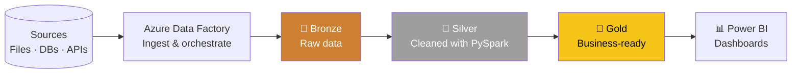

<!-- ============================================================
  SETUP
  1. Repo name must be EXACTLY: JoshuaMaiyaki  (public)
  2. Save this file as README.md in that repo
  3. Replace YOUR_LINKEDIN_HANDLE and YOUR_EMAIL below
  ============================================================ -->

<p align="center">
  
</p>

<p align="center">
  <a href="https://github.com/JoshuaMaiyaki">
    
  </a>
</p>

<p align="center">
  
  <a href="https://www.linkedin.com/in/joshua-irimiya-karfe-maiyaki-04b635289"></a>
  <a href="mailto:maiyakijoshua29@gmail.com"></a>
</p>

---

## 👋🏽 Hi, I'm Joshua Maiyaki

### Data Engineer | Analytics | Data Systems

I build data pipelines, transform messy data into usable datasets, and turn data into systems that support better decisions.

My background is in **Quantity Surveying**, but my curiosity about data led me into analytics and eventually into **Data Engineering**. Measuring, costing and getting the numbers right taught me to care about accuracy. That habit now goes into every pipeline I build. 🐧

📍 **Kaduna, Nigeria** · 🗣️ **English, Hausa**

---

## 🧾 About me, as a SQL query

```sql
SELECT
    name,
    role,
    background,
    location,
    languages
FROM me
WHERE passion = 'making data useful'
ORDER BY curiosity DESC
LIMIT 1;

-- name       → 'Joshua Irimiya-Karfe Maiyaki'
-- role       → 'Data Engineer / Data Analyst'
-- background → 'Quantity Surveying'
-- location   → 'Kaduna, Nigeria'
-- languages  → 'English, Hausa'
```

---

## 🧭 Choose your path *(click to expand)*

<details>
<summary><b>🏗️ I'm hiring / I need a Data Engineer</b></summary>
<br>

**What I work with**
- Data pipelines with **Azure Data Factory** and **Databricks**
- Data transformation with **PySpark** and **SQL**
- Data warehouse design and modelling in SQL

**Start here →** [🔗 Sales-SQL-Data-Warehouse](https://github.com/JoshuaMaiyaki/Sales-SQL-Data-Warehouse)

</details>

<details>
<summary><b>📊 I need insights / dashboards</b></summary>
<br>

**What I deliver**
- Clean, analysis-ready datasets
- Dashboards and reports in **Power BI** and **Excel**
- Analysis in **SQL** and **Python**

**Start here →** [🔗 My repositories](https://github.com/JoshuaMaiyaki?tab=repositories)

</details>

<details>
<summary><b>🤝 I want to collaborate or connect</b></summary>
<br>

Always happy to talk data, swap career-switch stories, or work on projects together. Reach out on LinkedIn or by email. 🚀

</details>

---

## 🔄 How I think about data pipelines



---

## 🧰 My toolkit

<details open>
<summary><b>Click to collapse / expand</b></summary>
<br>

**Languages & Query**


**Data Engineering & Cloud**


**Analytics & Visualisation**


</details>

---

## 🎓 Certifications


---

## 🚀 Featured project

| Project | What it does | Stack |
|---|---|---|
| [**🏭 Sales-SQL-Data-Warehouse**](https://github.com/JoshuaMaiyaki/Sales-SQL-Data-Warehouse) | A SQL data warehouse built for sales data | `SQL` |

<!-- Add a row per project, e.g.:
| [**Project name**](https://github.com/JoshuaMaiyaki/REPO) | One-line description | `Tools` |
-->

> 💡 Pin your best repos on your profile so they show right under this README.


---

## 📈 GitHub stats

<p align="center">
  
  
</p>

<p align="center">
  
</p>

---

## 🐧 My contribution snake *(eats my commits)*

<p align="center">
  <picture>
    <source media="(prefers-color-scheme: dark)" srcset="https://raw.githubusercontent.com/JoshuaMaiyaki/JoshuaMaiyaki/output/github-snake-dark.svg" />
    <source media="(prefers-color-scheme: light)" srcset="https://raw.githubusercontent.com/JoshuaMaiyaki/JoshuaMaiyaki/output/github-snake.svg" />
    
  </picture>
</p>

<!-- Needs the GitHub Action: save snake.yml as .github/workflows/snake.yml, then run it once from the Actions tab -->

---

<p align="center">
  <i>"Without data you're just another person with an opinion."</i>
  <br/>
  ⭐ If something here helped you, drop a star on a repo!
</p>


